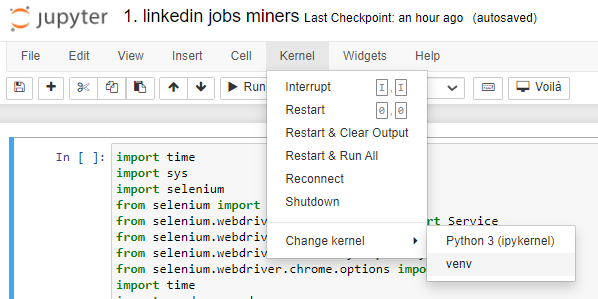
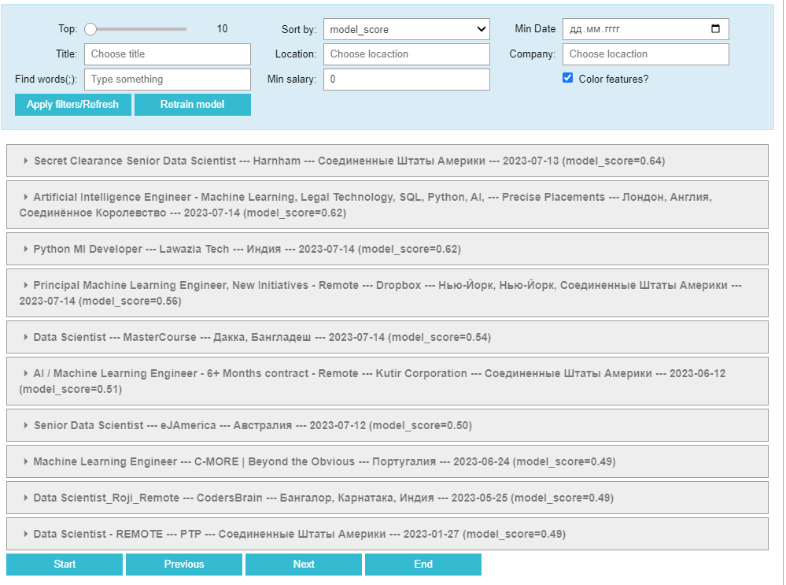
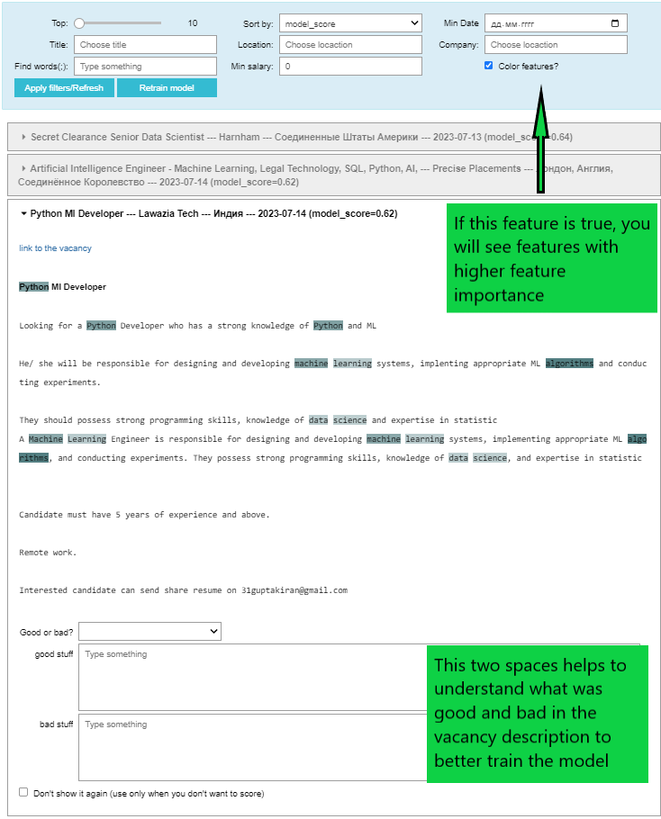

# linkedin-job-recommender
Mine/parse LinkedIn jobs and train the model to find the best options for you.

## How to use
1. Clone repository and change directory to ```linkedin-job-recommender``` as 
soon as it will be cloned:\
```git clone https://github.com/MaryRa/linkedin-job-recommender.git```
2. Install requirements\
```pip install -r requirements.txt```\
P.S. In order to use this environment, you should choose it in your jupyter 
notebook 
3. Parse jobs from LinkedIn. This code can help with this task:\
```1. linkedin jobs miners.ipynb```
4. Run the recommender and enjoy the process :)\
```2. linkedin jobs recommender.ipynb```


